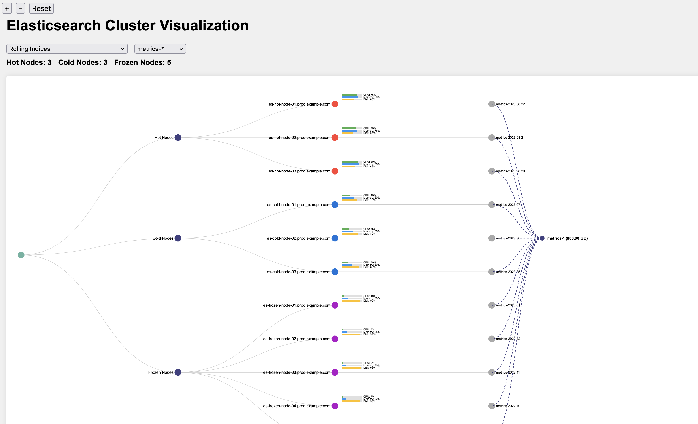

# Elasticsearch Cluster Diagnostics Visualizer

## Description

This project provides a visualization tool for Elasticsearch cluster diagnostics. It processes diagnostic data from an Elasticsearch cluster and generates an interactive HTML visualization of the cluster's structure, including node types, individual nodes, indices, and rolling index patterns.



## Disclaimer

**IMPORTANT:** This tool is provided as-is, without any warranties or guarantees. Neither the creator of this tool nor Elastic (the company behind Elasticsearch) can be held responsible for any issues, data loss, or damage that may occur from using this tool. Use it at your own risk and always ensure you have proper backups of your Elasticsearch data before running any diagnostic or visualization tools.

This tool is not officially supported by Elastic and is not a part of the official Elasticsearch product suite.

## Prerequisites

- Python 3.7 or higher
- Elasticsearch cluster diagnostic data (JSON format)
- Required Python libraries: `pandas`, `plotly`

## Installation

1. Clone this repository:
   ```
   git clone https://github.com/itsbanjo/elastic-ilm-index-node-visualization.git
   ```

2. Navigate to the project directory:
   ```
   cd elastics-ilm-index-node-visualization
   ```

3. Install the required Python libraries:
   ```
   pip install pandas plotly
   ```

## Usage

1. Ensure you have Elasticsearch cluster diagnostic data in JSON format. The tool expects the following files:
   - `nodes/nodes_stats.json`
   - `nodes/nodes_info.json`
   - `indices/indices_stats.json`

2. Run the main script with the path to your diagnostics directory:
   ```
   python main.py /path/to/your/diagnostics/directory
   ```

3. The script will generate an HTML file named `elasticsearch_cluster_visualization.html` in the same directory.

4. Open the generated HTML file in a web browser to view the interactive visualization.

## Features

- Interactive visualization of Elasticsearch cluster structure
- Filtering options:
  - View only cluster, node type, and individual nodes
  - Filter by rolling index patterns
  - Filter by individual indices
- Zoom and pan functionality
- Tooltips with detailed node and index information
- Display of total nodes for each node type
- Utilization bars for CPU, memory, and disk usage

## Customization

You can customize various aspects of the visualization by modifying the following files:
- `config.py`: Adjust configuration settings
- `data/processor.py`: Modify data processing logic
- `visualization/generator.py`: Change visualization generation parameters
- `visualization/templates/visualization_template.html`: Alter the HTML template for the visualization

## Troubleshooting

If you encounter any issues:
1. Check the console output for error messages
2. Ensure your diagnostic data is in the correct format and location
3. Verify that all required Python libraries are installed
4. Check the logs for any specific error information

## Contributing

Contributions to improve this tool are welcome. Please fork the repository and submit a pull request with your changes.

## License

This project is licensed under the MIT License - see the LICENSE file for details.

## Acknowledgments

- This tool uses D3.js for visualization
- Inspired by the Elasticsearch community and the need for better cluster diagnostics visualization

Remember: Always use this tool responsibly and ensure you have proper authorization to access and visualize your Elasticsearch cluster data.
